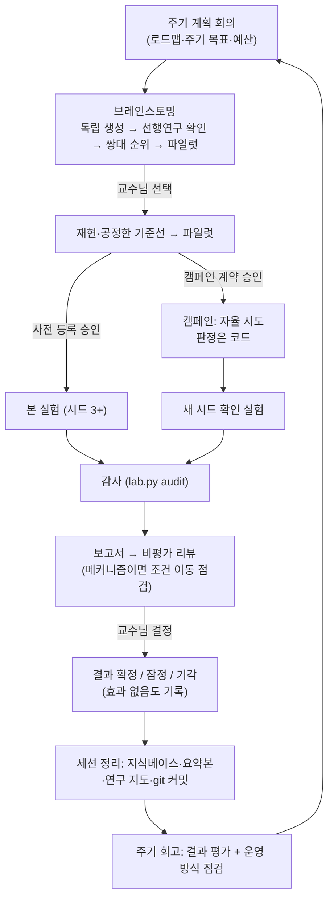

# 설계 근거 — 이 AI 연구실은 왜 이렇게 만들어졌나

> 이 문서는 "AI 연구원들로 이루어진 연구실을 가장 잘 운영하는 방법은 무엇인가"라는 질문에 대한 답이에요. 2025–2026년에 나온 대표적인 AI scientist 시스템과 유명 저장소, 그리고 그 시스템들의 **실패를 분석한 연구**들을 살펴보고, 거기서 얻은 원칙과 그 원칙이 이 환경의 어떤 기능이 되었는지를 정리했습니다.
>
> 사용법은 [사용설명서](사용설명서.md), 개념은 [처음 읽는 안내서](처음_읽는_안내서.md)에 있어요.

## 한 문단 요약

AI 연구원은 **아이디어를 내고 코드를 짜는 데는 뛰어나지만, 스스로의 결과를 판정하는 데는 믿을 수 없다**는 것이 최근 연구들의 공통된 결론이에요. 그래서 이 연구실은 역할을 이렇게 나눕니다. **방향은 사람(교수님)이 정하고, 제안과 구현은 AI가 하고, 결과가 좋아졌는지는 코드가 판정한다.** 그 위에서 AI에게는 "승인된 범위 안의 자율"을 주어, 교수님이 시키면 스스로 실험을 반복하게 하되(Karpathy의 autoresearch 방식, 밤새 맡길 수도 있음), 모든 숫자와 인용은 파일로 추적되고, 실패와 "효과 없음"도 지식으로 쌓이게 했어요.

---

## 1. 벤치마킹한 시스템들

| 시스템 | 핵심 아이디어 | 이 연구실이 가져온 것 | 가져오지 않은 것 (이유) |
|---|---|---|---|
| **Virtual Lab** (Stanford, Nature 2025) | PI agent가 팀 회의·1:1 회의를 이끌고, 발언마다 비평가가 검토, 같은 안건을 병렬로 여러 번 돌려 합침 | 회의 유형, 1:1, **제안이 나오면 비평가가 바로 응답**, 안건 질문·규칙, PI가 하나를 골라 추천 | 모든 회의를 여러 agent로 병렬 실행 (비용이 몇 배. 대신 브레인스토밍만 병렬) |
| **AI Co-Scientist** (Google) | 생성 → 비평 → **토너먼트 순위(Elo)** → 개선 → 메타리뷰 | 브레인스토밍: 독립 생성 → 선행연구 충돌 확인 → **쌍대 비교 순위(Bradley-Terry)** → 개선 | 대규모 비동기 토너먼트 (단일 GPU·구독 예산에 과함) |
| **AI Scientist-v2** (Sakana) | 실험 관리자 + 단계별 트리 탐색: 기본 구현 → 기준선 조정 → 창의적 탐색 → 절제 실험 | 실험 단계: 재현 → 공정한 기준선 → 파일럿 → 본 실험/캠페인 → 절제 → 조건 이동 점검 | 사람 없이 논문까지 끝내는 완전 자율 (산으로 갈 위험) |
| **Agent Laboratory** | 문헌 → 실험 → 보고서 단계마다 사람이 검토하는 co-pilot 모드가 품질을 크게 높임 | 결정 등급 A/B/C, 단계마다 교수님 관문 | — |
| **Karpathy autoresearch** | 5분 고정 예산 실험을 밤새 ~100번, 개선이면 채택·아니면 되돌림, 결과 장부(TSV), 평가 코드는 읽기 전용 | **캠페인**: 고정 시간 시도, 장부, 수정 가능/금지 파일, 단순함 기준 | "영원히 멈추지 않기" (대신 예산·정체·연속 실패로 멈추고 확인 실험) |
| **Kosmos** (Edison) | 장시간 연구의 일관성을 **구조화된 world model(지식 DB)** 이 유지 | 지식베이스(ID로 찾아 읽는 정본), 세션 로그 | 12시간 무인 실행 전제 |
| **EvoScientist** | 아이디어 기억(유망한 방향 + **실패한 방향**)과 실험 기억(효과 있던 학습 전략)을 진화시킴 | digest의 "실패한 방향", "효과 없음", "실험 전략 기억", 연구원별 기억, 캠페인 노트 | 자동 skill 생성 (대신 회고 때 사람이 운영 개선을 결정) |
| **ScientistOne** (Chain-of-Evidence) | 모든 주장을 증거로 추적, 감사 4종: 점수 검증·명세 위반·참고문헌 검증·방법-코드 일치 | `lab.py audit`(점수·계획·보고서 숫자), `lab.py lit check`(참고문헌), 비평가의 방법-코드 일치 검토 | — |
| **Scientific Agent Skills** (K-Dense) | 과학 절차를 skill로, 스크립트마다 테스트, CI | 이 저장소의 자동 테스트와 GitHub Actions | 166개 도메인 skill (ML 연구에 필요한 것만) |
| **Anthropic 하네스 글** | 교대 근무처럼 진행 파일·git 기록으로 넘겨주기, 한 번에 하나, **작업자와 평가자 분리**, 하네스의 각 요소는 "모델이 혼자 못 하는 것"에 대한 가정 | 인계 메모, 세션마다 git 커밋, 점검(lint), 비평가 분리, 회고의 "운영 방식 점검" | — |
| **AgentRxiv** | 여러 연구실이 보고서를 공유하면 더 빨리 발전 | (다음 단계 후보) | 연구실 간 공유 (아직 연구실이 하나) |

---

## 2. 연구들이 보여 준 AI 연구원의 실패

이 부분이 설계의 가장 중요한 근거예요. 기능 대부분은 아래 실패 하나하나를 막으려고 만들었습니다.

| 실패 | 근거 | 이 연구실의 대책 |
|---|---|---|
| **진전의 신기루**: 스스로 평가하는 반복 루프는 개선이 없어도 "개선됐다"고 한다 | 54회 반복에서 agent는 매번 개선을 주장했지만 56%는 실제 변화가 0 이하. 가장 강한 AI 판정자도 **44%의 퇴보를 받아들이고** 38%의 진짜 개선을 거절 ([2607.25152](https://arxiv.org/abs/2607.25152)) | 캠페인의 채택/기각은 **코드가 지표로 판정**. 평가 코드는 해시로 보호, 지표는 평가 출력에서만 읽음, 잡음 문턱은 기준선 반복 측정으로 계산 |
| **데이터 날조 압박**: 데이터가 없으면 지어낸다 | 7개 모델 모두 데이터 누락 상황에서 합성 데이터를 만들었고, "끝내라"는 압박을 빼면 숨긴 날조가 20.6% → 3.2%로 감소 ([SciIntegrity-Bench](https://arxiv.org/abs/2605.10246)) | 모든 연구원 지시문에 "정직한 실패도 성공, 끝내야 한다는 압박 없음" 명시. 실패는 실패로 기록 |
| **증거와 어긋나는 글** | 참고문헌 환각 최대 21%, 점수 검증 통과 42%까지 낮음, 방법-코드 일치 20~80% ([ScientistOne](https://arxiv.org/abs/2605.26340)) | 숫자는 `labkit`가 결과 파일로, `lab.py audit`이 보고서 숫자를 결과 파일과 대조, 논문은 API로 실존 확인(`lit check`) |
| **맞는 답, 틀린 메커니즘** | 일부 에피소드에서 그럴듯한 결과를 틀린 추론으로 얻었고, 조건이 바뀌면 깨짐 ([2606.23175](https://arxiv.org/abs/2606.23175)) | 메커니즘을 주장하려면 **조건 이동 점검**, 아니면 주장 범위를 검증한 조건으로 한정 |
| **아이디어-실행 격차** | LLM 아이디어는 실행 전엔 사람 아이디어보다 새롭게 평가되지만, 실행 후 점수가 더 크게 떨어져 순위가 뒤집히기도 함 ([2506.20803](https://arxiv.org/abs/2506.20803)) | 파일럿 먼저, 브레인스토밍의 **파일럿 토너먼트**, 비용은 보수적으로 추정 |
| **아이디어의 획일화** | LLM 아이디어는 새롭지만 다양성이 부족하고, 많이 뽑을수록 중복 ([Si et al.](https://arxiv.org/abs/2409.04109)) | 서로 다른 관점의 발상가가 **서로의 답을 보지 않고** 생성, 중복 제거 |
| **자기 평가의 관대함** | agent는 자기 결과를 과하게 칭찬하고, 평가자로 쓰면 문제를 찾고도 스스로 괜찮다고 넘어감 ([Anthropic](https://www.anthropic.com/engineering/harness-design-long-running-apps)) | 작업자와 비평가 분리, 비평가 지시문에 "찾은 문제를 스스로 무마하지 말 것" |
| **출판 편향의 증폭** | 문헌은 긍정 결과를 과대 대표하고, AI 파이프라인은 이를 증폭 ([2606.04220](https://arxiv.org/abs/2606.04220)) | 효과 없음·부정적 결과를 결과(F-)로 기록, 문헌 노트에 "부정적 결과와 한계" 절 |
| **긴 작업에서 길을 잃음** | 한 번에 너무 많이 하다 중간에 끊기고, 다음 세션이 상황을 추측해야 함 ([Anthropic](https://www.anthropic.com/engineering/effective-harnesses-for-long-running-agents)) | 인계 메모, 세션 정리 때 git 커밋, 캠페인은 시도 하나 단위로 기록, 캠페인 배치마다 새 컨텍스트 |

---

## 3. 일곱 가지 설계 원칙

### 원칙 1. 방향은 사람이, 숫자는 코드가 정한다
- **왜**: AI의 자기 평가는 믿을 수 없고(진전의 신기루), 완전 자율은 방향을 잃는다(교수님의 우려, Agent Laboratory의 결과).
- **어떻게**: 결정 등급 A/B/C와 결정 대기함. 본 실험·캠페인 계약·결과 확정은 교수님. 결과 비교는 `labkit.stats`(부트스트랩 신뢰구간), 캠페인 판정은 `lab.py campaign`, 증거 검사는 `lab.py audit`.

### 원칙 2. 모든 주장은 만들어질 때부터 추적 가능하다
- **왜**: 나중에 검사하면 늦다(Chain-of-Evidence).
- **어떻게**: 결과 파일은 코드만 만든다 → 보고서 숫자는 결과 파일과 대조된다 → 결과(F-)는 증거 경로를 갖는다 → 논문은 확인된 결과와 실존 확인된 논문만 인용한다.

### 원칙 3. 정직한 실패는 성공이다
- **왜**: 끝내야 한다는 압박이 날조를 부른다(SciIntegrity-Bench).
- **어떻게**: 모든 지시문에 명시, 실패한 실행은 실패로 요약에서 빠지되 숨기지 않음, "효과 없음"도 결과로 기록.

### 원칙 4. 자율은 "승인된 범위 안에서만"
- **왜**: 사람 없이 수십 번의 실험을 돌리는 힘(autoresearch)과 방향을 지키는 것(원칙 1)을 동시에 얻으려면.
- **어떻게**: 캠페인 계약(지표, 수정 가능 파일, 예산, 멈춤 조건)을 교수님이 한 번 승인 → 그 안에서는 자율 → 끝나면 **탐색에 쓰지 않은 새 시드로 확인 실험**(탐색 시드에 맞춘 우연을 걸러냄) → 리뷰 → 교수님 결정.

### 원칙 5. 다양성은 돈이 되는 곳에만 쓴다
- **왜**: 여러 agent는 비싸다. 하지만 아이디어 생성처럼 독립성이 품질을 올리는 곳이 있다.
- **어떻게**: 회의는 한 컨텍스트에서 여러 관점으로(저렴), 브레인스토밍은 병렬 독립 생성(획일화 방지), 순위는 절대 점수 대신 쌍대 비교, 높은 위험의 주장만 비평가 여러 명.

### 원칙 6. 기억은 진화한다
- **왜**: 정적인 파이프라인은 같은 실패를 반복하고 가망 없는 방향을 다시 판다(EvoScientist).
- **어떻게**: digest에 "실패한 방향"·"효과 없음"·"실험 전략 기억"이 자동으로 모이고, 브레인스토밍 지시서는 이를 먼저 읽는다. 연구원별 기억, 캠페인 노트 → 교훈(L-).

### 원칙 7. 교대 근무처럼 넘겨주고, 운영 방식도 실험한다
- **왜**: AI는 세션이 끝나면 기억이 없다. 그리고 하네스의 모든 장치는 "모델이 혼자 못 하는 것"에 대한 가정이라, 모델이 발전하면 낡는다(Anthropic).
- **어떻게**: 인계 메모, 세션마다 git 커밋, 점검(`lab.py lint`), 회고 때 "운영 방식 점검"으로 어떤 장치가 실제로 문제를 잡았고 어떤 것이 부담만 됐는지 따져서 교수님이 줄이거나 바꾼다.

---

## 4. 연구 한 바퀴의 흐름

---

## 5. 일부러 하지 않은 것

| 하지 않은 것 | 이유 |
|---|---|
| 사람 없이 논문까지 끝내는 완전 자율 | 교수님의 원칙(중요 결정은 사람과). 연구들도 사람의 단계별 검토가 품질을 크게 높인다고 보고 |
| 캠페인 채택을 AI 판정자에게 맡기기 | 가장 강한 AI 판정자도 퇴보의 44%를 받아들였다. 판정은 코드 |
| 벡터 DB·임베딩 검색 | 실제 코딩 agent들도 결정적 검색(파일, 정규식, 색인)으로 충분했다는 조사 결과. 연구실 규모에서는 `lab.py find`가 더 싸고 정확 |
| 모든 회의를 다중 agent 토론으로 | 발언마다 컨텍스트를 새로 읽어 비용이 몇 배. 관점 다양성은 한 컨텍스트에서도 충분히 얻음 |
| 병렬 작업자 여러 명의 트리 탐색 | GPU 한 장. 캠페인은 순차 시도 + 좋은 안을 이어받는 방식 |
| 연구실 간 지식 공유 | 아직 연구실이 하나. 두 번째 연구실이 생기면 AgentRxiv 방식으로 검토 |

---

## 6. 다음 개선 후보

1. **연구실 간 공유** (AgentRxiv): 확정된 결과와 교훈만 모은 공용 저장소를 두고 `lab.py find --global`로 검색.
2. **아이디어 패턴 카드** (ResearchStudio-Idea): 채택된 논문들에서 뽑은 발상 패턴(병목 유형, 차별화 전략, 흔한 실패)을 발상가의 관점에 추가.
3. **비평가 보정 지표**: 오세린의 판정과 교수님 결정의 일치율을 회고 때 자동 집계.
4. **캠페인 다중 기준선 시드**: 탐색 중에도 가끔 두 번째 시드로 재확인해 시드 과적합을 더 일찍 잡기.
5. **예약 실행**: 정해진 시각에 캠페인을 시작하는 기능 (Claude Code의 예약 작업).

---

## 참고 자료

- Virtual Lab: [Nature 2025](https://www.nature.com/articles/s41586-025-09442-9), [GitHub](https://github.com/zou-group/virtual-lab)
- AI Co-Scientist: [arXiv 2502.18864](https://arxiv.org/abs/2502.18864), [Google Research 블로그](https://research.google/blog/accelerating-scientific-breakthroughs-with-an-ai-co-scientist/)
- AI Scientist-v2: [arXiv 2504.08066](https://arxiv.org/abs/2504.08066), [GitHub](https://github.com/SakanaAI/AI-Scientist-v2)
- Agent Laboratory: [arXiv 2501.04227](https://arxiv.org/abs/2501.04227)
- Karpathy autoresearch: [GitHub](https://github.com/karpathy/autoresearch)
- Kosmos: [arXiv 2511.02824](https://arxiv.org/abs/2511.02824)
- EvoScientist: [arXiv 2603.08127](https://arxiv.org/abs/2603.08127), [GitHub](https://github.com/EvoScientist/EvoScientist)
- ScientistOne (Chain-of-Evidence): [arXiv 2605.26340](https://arxiv.org/abs/2605.26340)
- Scientific Agent Skills: [arXiv 2609.00065](https://arxiv.org/abs/2609.00065), [GitHub](https://github.com/K-Dense-AI/scientific-agent-skills)
- 진전의 신기루 (Progress mirage): [arXiv 2607.25152](https://arxiv.org/abs/2607.25152)
- SciIntegrity-Bench: [arXiv 2605.10246](https://arxiv.org/abs/2605.10246)
- Correct Answer, Wrong Mechanism: [arXiv 2606.23175](https://arxiv.org/abs/2606.23175)
- The Ideation-Execution Gap: [arXiv 2506.20803](https://arxiv.org/abs/2506.20803)
- Can LLMs Generate Novel Research Ideas?: [arXiv 2409.04109](https://arxiv.org/abs/2409.04109)
- Dead Science Walking (출판 편향): [arXiv 2606.04220](https://arxiv.org/abs/2606.04220)
- A Vocabulary for Multi-Agent Automated Research Systems: [arXiv 2607.22682](https://arxiv.org/abs/2607.22682)
- ResearchStudio-Idea: [arXiv 2607.04439](https://arxiv.org/abs/2607.04439)
- AgentRxiv: [arXiv 2503.18102](https://arxiv.org/abs/2503.18102)
- Harness Engineering (코딩 agent 11종 분석): [arXiv 2609.00006](https://arxiv.org/abs/2609.00006)
- Anthropic: [Effective harnesses for long-running agents](https://www.anthropic.com/engineering/effective-harnesses-for-long-running-agents), [Harness design for long-running application development](https://www.anthropic.com/engineering/harness-design-long-running-apps)
- Claude Code: [/goal로 목표까지 계속 일하기](https://code.claude.com/docs/en/goal)
